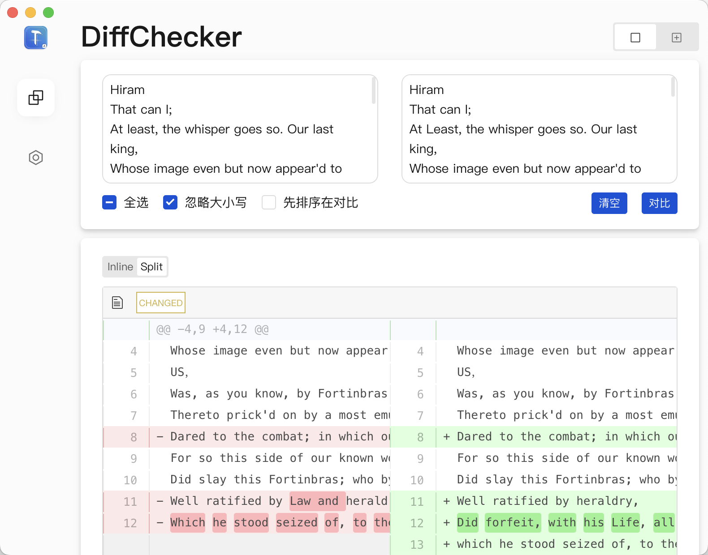
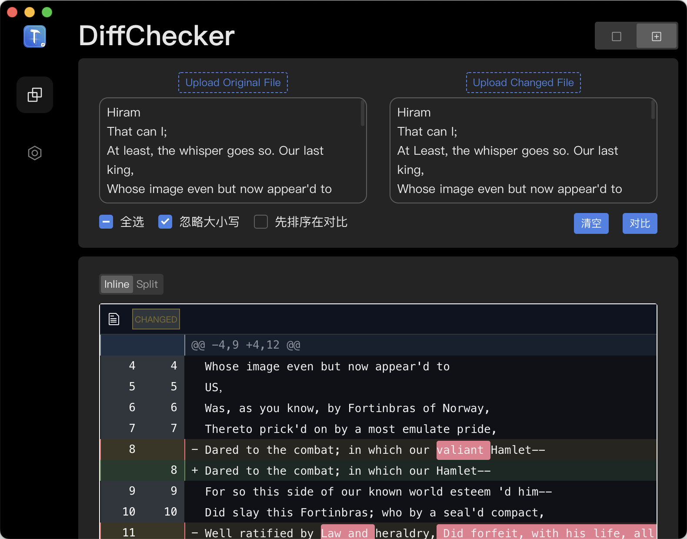

# 工具合集

在兴趣的驱动下,写下此工具，有欣喜，也还有汗水，希望你喜欢与支持此的作品。

> 采用`vite + vue3 + electron13 + vue-router + pinia + tdesign`

# 截图

# 未来

- [ ] electron与vue 外观不同步
- [x] ...

# 安装

## 下载

请前往releases

## 开发

1. git clone
2. yarn
3. yarn server[启动vite] yarn electron:servel[启动electron] 
4. yarn build[构建vite] yarn electron:build[构建electron] 

# Bug

- 本项目问题请提交issues
- 不解决diif2html问题,请前往该仓库提issue

# 感谢以下的项目,排名不分先后

* [MyDiffTool](https://github.com/imzjy/MyDiffTool) Diff代码参考此仓库
* [react-code-diff-lite](https://github.com/IFmiss/react-code-diff-lite) diff2html dark样式源于此仓库